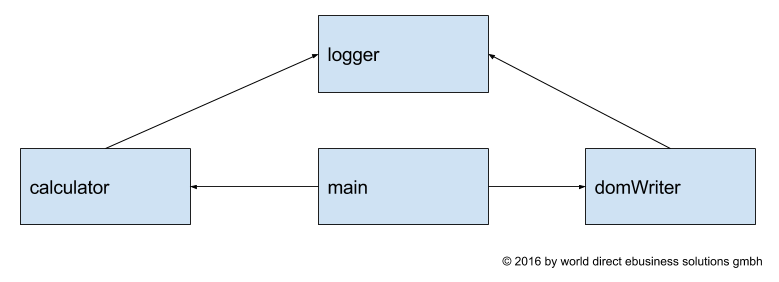

Termin 1
===
> Ökosystem für die moderne Frontend-Entwicklung auf Basis von Web-Technologien

#### Vortragende
   
 **Christian Schaiter und Mathias Feitzinger**


## Agenda
* Node Package Manager (npm): Das Package Management System für node.js
    * Wie werden alle weiteren notwendigen Tools/Frameworks/Bibliotheken geladen und eingebunden
* Module Loaders und Module Bundlers
    * Unterschiede zwischen AMD und CommonJS
    * SystemJS vs. Webpack: State-of-the-Art Module-Loaders / Module Bundlers
* TaskRunner:  
    * Automatisierte Frontend-Builds (ähnlich zu Ant in Java) am Beispiel von Gulp
    * Integration in TFS-Builds 
* Entwicklung mit Typescript
    * Best Practices von TypeScript  für Angular 2 (Annotationen, Klassen, Interfaces, Imports, Module, etc.)
    * Verwenden von JS-Fremdbibliotheken mit Hilfe von Declaration-Files
    * Visual Studio Code
    * Kurzeinführung in den neuen Code-Editor von MS


# [1. Node.js](https://nodejs.org/en/)

> Javascript für Server

* [Node.js](https://nodejs.org/en/) ist eine serverseitige Plattform für die Entwicklung von serverseitigen Programmen direkt in Javascript. 
* Läuft als Dienst am Computer (Mac, Windows, Linux etc..) ([Download](https://nodejs.org/en/download/) für Windows).
* Ermöglicht die Entwicklung der gesamten Serverumgebung (Bsp.: [Trello](https://trello.com/)).
* Enthält mit [NPM](https://www.npmjs.com/) (Node Packet Manager) einen eigenen Pakete-Manager.

### :rocket: Demo :rocket:  
```bash
npm install -g hangman-game
```
Lets play :stuck_out_tongue_closed_eyes: :video_game: :video_game: :video_game: :video_game: :video_game: :video_game: :video_game: :video_game: 


# [2. Node Package Manager](https://www.npmjs.com/)

> Für C# Entwickler: NPM ~ NuGet for Javacript  

* Integrierte Paket-Verwaltung von Node.js (wird bei der Installation von Node.js mitinstalliert)
* Erweitertes Dependency-Management System (alle Abhängigkeiten werden mitgeladen)
* Versionssicherheit durch [Semantic Versioning](http://semver.org/) (semver) 
 
### :rocket: Demo :rocket: `git checkout sample_01`

* Neue Konfigurationsdatei für NPM (package.json) anlegen: `npm init`
* [Live-Server](https://www.npmjs.com/package/live-server): Einfacher HTTP-Server für die Entwicklung: `npm install -g live-server` bzw. zum Starten: `live-server`

**index.html**
```html
<!DOCTYPE html>
<html lang="en">
    <head></head>
    <body>
        <h1>May the force be with you!</h1>
        <span>You are </span>
        <span id='name'>???</span>
        <script src="./main.js" type="text/javascript"></script>
    </body>
</html>
```

**main.js**
```JavaScript
'use strict';

function forceMe(){
    var nameSpan = document.getElementById('name');
    nameSpan.innerHTML = "Franz";
}

forceMe();
```

## Einbindung eines NPM Paktets (einfachste Art)

* Abhängigkeit zu [NPM Paket](https://www.npmjs.com/package/random-lastname) herstellen `npm install random-lastname --save`
* Verwendung des neuen Paketes in `main.js`:

```JavaScript
var randomLastname = require("random-lastname");
```

**:boom:ERROR:boom: :scream::scream::scream:**
* Der Browser versteht die obige `require` Funktion nicht.
* Es wird also eine Bibliothek benötigt, die diese Funktionalität liefert (Module Loader) oder es muss die Funktionalität bereits beim Kompilieren mitgeliefert werden (Module Bundler).
* Wir verwenden einen einfachen Module Bundler: Browserify
* [npm-run](https://www.npmjs.com/package/npm-run): Startet NPM Executables direkt, ohne lästiges Referenzieren in den node_modules Ordner: `npm install -g npm-run`
* [browserify](http://browserify.org/): Stattet obigen Code mit der notwendigen Funktionalität aus: `npm install browserify --save-dev`
* [watchify](https://www.npmjs.com/package/watchify): Automatische Kompilierung mit Browserify nach jeder Änderungen: `npm install watchify -g` bzw. zum Starten `watchify main.js -o static/bundle.js`

Da wir nun ein NPM Paket eingebunden haben, müssen wir die HTML-Datei sowie den Javascript-Code entsprechend anpassen:

**index.html**
```html
<!DOCTYPE html>
<html lang="en">
    <head></head>
    <body>
        <h1>May the force be with you!</h1>
        <span>You are </span>
        <span id='name'>???</span>
        <button onclick="forceMe()">Force me!!</button>
        <script  src="bundle.js" type="text/javascript"></script>  
    </body>
</html>
```

**main.js**
```JavaScript
'use strict';

var randomLastname = require("random-lastname");

function forceMe(){
    var nameSpan = document.getElementById('name');
    nameSpan.innerHTML = randomLastname() + " " + randomLastname();
}

forceMe();
// Required to reference the function from the <button> tag after compilation with Browserify
window.forceMe = forceMe;
```

Mit diesen Änderungen funktioniert der Code wieder und wir haben unser erstes Paket eingebunden.


## Wichtige NPM Befehle:

* Neues Paket installieren: `npm install <PACKAGE_NAME>`
* Neues Paket installieren und einen Verweis in `package.json` ablegen: `npm install <PACKAGE_NAME> --save`
* Neues Paket für den Entwicklungsprozess installieren: `npm install <PACKAGE_NAME> --save-dev `
* Paket "global" installieren: `npm install <PACKAGE_NAME> --global`
* Alle Pakete für das aktuelle Projekt installieren (Informationen kommen aus `package.json`): `npm install`
* Alle Pakete für das aktuelle Projekt updaten (Informationen kommen aus `package.json`): `npm update`


## Semantic versioning (semver) <sup>[Image Sources](http://bytearcher.com/goodies/semantic-versioning-cheatsheet/)</sup>


### Pitfalls bei der Versionierung  

* Man installiert auf dem Entwicklerrechner mit NPM die aktuelle Version und arbeitet dann ohne Update einige Zeit damit.
* Wenn dann bei der Produktivsetzung am Build-Server der Frontend-Build ausgeführt wird, kann man eine andere (neuere) Version bekommen.
* Sollte diese Version Breaking-Changes oder einen Bug haben, fällt dies erst in der Produktion auf (getestet wurde mit der lokal installierten Version) 


# [3. JavaScript Modules]() :bug:todo:bug:

> Use Modules to organize your JavaScript Codes




## Module Formats vs Module Loaders vs Module Bundlers 

## 1. Generel 

### :rocket: Demo :rocket: `git checkout Sample_02`
Schreiben von Plain Old Javacsript Files:

**calculator.js**
```javascript
var calculator = function () {

    function add(summand1, summand2) {
        logger.log("Add " + summand1 + "+" + summand2);
        return summand1 + summand2;
    }

    function multiply(factor1, factor2) {
        logger.log("Multiply " + factor1 + "*" + factor2);
        
        return factor1 * factor2;
    }

    function modulo(dividend, divisor) {
        logger.log("Modulo " + dividend + "%" + divisor);
        
        return dividend % divisor;
    }

    return  {
        add: add,
        multiply: multiply,
        modulo: modulo
    }
}();
```

**domWriter.js**
```javascript
var domWriter = function () {

    function write(selector, input) {
        logger.log("Write " + input + " to inner html of selector " + selector);
        var nameSpan = document.getElementById(selector);
        nameSpan.innerHTML = input;
    }

    return{
        write: write
    }
}();

```

**logger.js**
```javascript
var logger = function () {

    function logMessage(message) {
        console.log(message);
    }

    return {
        log: logMessage
    }
} ();
```


**main.js**
```javascript
var calculate = function () {
    var addResult = calculator.add(100, 400);
    domWriter.write('add-result', addResult);

    var multiplicationResult = calculator.multiply(4, 8);
    domWriter.write('multiplication-result', multiplicationResult);

    var moduloResult = calculator.modulo(25, 4);
    domWriter.write('modulo-result', moduloResult);
};
```

Verwendung dieser im Html:
**index.html**
```html
<!DOCTYPE html>
<html lang="en">
<head>
    <link rel="stylesheet" type="text/css" href="./node_modules/bootstrap/dist/css/bootstrap.css">
</head>
<body class="container">
    <div class="jumbotron">
        <h1>Calculation Results</h1>
        <ul>
            <li>Addition 400 + 100 = <span id="add-result">???</span></li>
            <li>Multiplication 4 * 8 = <span id="multiplication-result">???</span></li>
            <li>Modulo 25 % 4 = <span id="modulo-result">???</span></li>
        </ul>
        <button onclick='calculate()' class="btn btn-primary">Calculate Result</button>
    </div>
    <script src="logger.js"></script>
    <script src="calculator.js"></script>
    <script src="domWriter.js"></script>
    <script src="main.js"></script>
</body>
</html>
```

Fertiges Beispiel ist mit  ```git checkout Sample_02Completed``` erreichbar!

#### Probleme
* Alles im Global Scope :boom: :boom:. Somit Probleme mit anderen Modulen
* Manuelle Dependency Resolution notwendig


## 2. Module Formats and Loaders ```git checkout Sample_03```
### AMD mit RequireJs
> AMD ist das Format für Browseranwendungen!

Module werden mit ```define()``` definiert. 
#### AMD Syntax
```javascript
define(['\logger'], function(logger){

    var flyToTheMoon = function(){
        logger.log('So Long, and Thanks for All the Fish');
    }
    return {
        flyToTheMoon: flyToTheMoon
    }
});
```
####  :rocket: Demo :rocket: `git checkout Sample_03`
* Alle Module in AMD umschreiben
* RequireJs installieren `npm install requirejs --save`
* index.html umschreiben

- [x] Global Scope wird nicht mehr verwendet
- [x] Dependencymanagement wird von RequiereJs übernommen!
- [x] Keine Namenskonflikte möglich!


Fertiges Beispiel ist mit  ```git checkout Sample_03Completed``` erreichbar!


### CommonJS mit SystemJS
> CommonJS ist das Module System für node.js Anwendungen.

Öffentliche Methoden werden, innerhalb eines Modules, mit einer Zuweisung 
zu ```export``` oder ```module.export``` bekannt gegeben. 
Abhängigkeiten können mit ```require()``` angegeben werden.
#### CommonJS Syntax:
```javascript
    var logger = requiere('logger.js');

    var flyToTheMoon = function(){
        logger.log('So Long, and Thanks for All the Fish');
    }
    exports.flyToTheMoon = flyToTheMoon
    }
});
```

####  :rocket: Demo :rocket: ```git checkout Sample_04```
* Alle Module in CommonJS umschreiben
* SystemJS installieren ```npm install Systemjs --save```
* index.html umschreiben

Fertiges Beispiel ist mit  ```git checkout Sample_04Completed``` erreichbar!


## 3. ES2015 bzw TypeScript
ES2015 oder TypeScript haben ein umfangreiches Modulsystem. Jedoch versteht aktuell noch kein aktueller
Browser ES2015 und Typescript muss immer in JavaScript komiliert werden. 
Deshalb muss also der Code immer in eine ECMAScript-Version, die aktuelle
Browser verstehen,  transpiled werden.

    * [babel](https://babeljs.io/) ES15 Support für Browser
    * [tsc](https://www.typescriptlang.org/) Compiler für TypeScript

####  :rocket: Demo :rocket: ```git checkout Sample_05```
* Umschreiben der Scripte von *.js zu *.ts
    * ```module``` keyword
    * ```export``` keyword
    * ```import``` keyword
 * TypeScript hinzufügen: ```npm install typescript --save-dev```
 * TypeScript zu JavaScript compilieren ```tsc main.ts -outDir build```
    * Resultat wird in _CommonJS_ ausgegeben
 * System.js für Module Loading ```npm install systemjs --save```

Fertiges Beispiel ist mit  `git checkout Sample_05Completed` erreichbar!

## 4. Module Bundlers
Die bisherigen Lösungen hatten immer den Nachteil, dass sie der Browser für jedes Module
eine eigene JavaSCript Datei laden musste. Das kann sehr schnell zu Problemen führen, da 
Module ja eher klein gehalten werden und die Anzahl an vorhanden Modulen sehr schnell steigt.

Aus diesem Grund werden Module Bundler verwendet. Diese Bundeln alle notwendigen JavaScript
Dateien zu einem großen JavaSCript. Der Browser muss, im besten Fall, somit nur eine einzige
JavaScript Datei laden. 

* Browserify (siehe **sample_01**)
* Webpack

# [4. Webpack](https://webpack.github.io)
> Bündelt **alle** Resourcen für ein Web Projekt zusammen. Von Javascript über CSS bishin zu Bildern,
Fonts etc..

## Basic Concepts
### Entry
```javascript
module.exports = {
    entry: './main'
}
 ```

### Output
```javascript
module.exports = {
    entry: './main',
    output: {
        path: 'build',
        filename: 'bundle.js'
    }
}
 ```
### Loaders
```javascript
module.exports = {
    entry: './main',
    output: {
        path: 'build',
        filename: 'bundle.js'
    },
    module: {
        loaders: [
            { test: /\.ts$/, loader: 'ts-loader' }
        ]
    }
}
 ```
### Plugins
```javascript
module.exports = {
    entry: './main',
    output: {
        path: 'build',
        filename: 'bundle.js'
    },   
    module: {
        loaders: [
            { test: /\.ts$/, loader: 'ts-loader' }
        ]
    },
    plugins: [
        new webpack.optimize.UglifyJsPlugin()
    ]
}
 ```

####  :rocket: Demo :rocket: ```git checkout Sample_06```

`npm install webpack --save-dev`
`npm install ts-loader --save-dev`
