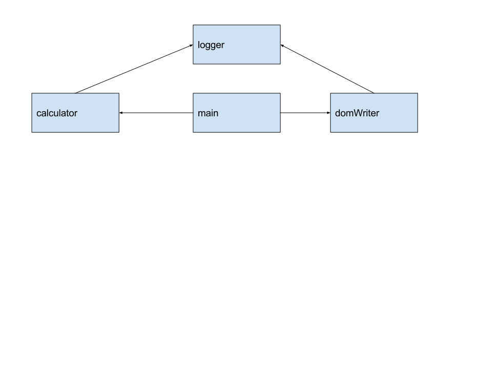

Termin 1
===
> Ökosystem für die moderne Frontend-Entwicklung auf Basis von Web-Technologien

#### Vortragende
   
 **Christian Schaiter und Mathias Feitzinger**


## [Agenda]()
* Node Package Manager (npm): Das Package Management System für node.js
    * Wie werden alle weiteren notwendigen Tools/Frameworks/Bibliotheken geladen und eingebunden
* Module Loaders und Module Bundlers
    * Unterschiede zwischen AMD und CommonJS
    * SystemJS vs. Webpack: State-of-the-Art Module-Loaders 
* TaskRunner:  
    * Automatisierte Frontend-Builds (ähnlich zu Ant in Java) am Beispiel von Gulp
    * Integration in TFS-Builds 
* Entwicklung mit Typescript
    * Best Practices von TypeScript  für Angular 2 (Annotationen, Klassen, Interfaces, Imports, Module, etc.)
    * Verwenden von JS-Fremdbibliotheken mit Hilfe von Declaration-Files
    * Visual Studio Code
    * Kurzeinführung in den neuen Code-Editor von MS

# [1. Node.js](https://nodejs.org/en/)
> Javascript für Server


* Javascript direkt am Rechner ausführen. 
* [Node.js](https://nodejs.org/en/) läuft als Dienst am Computer (Mac, Windows, Linux etc..)

### :rocket: Demo :rocket:  
```bash
npm install -g hangman-game
```
Lets play :stuck_out_tongue_closed_eyes: :video_game: :video_game: :video_game: :video_game: :video_game: :video_game: :video_game: :video_game: 


# [2. Node Package Manager](https://www.npmjs.com/)
 > Für C# Entwickler: NPM ~ NuGet for Javacript  

* Package Verwaltung
* Erweitertes Dependencymanagement System
* Versionssicherheit bei Package Versionssprüngen. 
* Gesamte Serverumgebung mit Node möglich :mouse: (bsp.: [Trello](https://trello.com/))
 
### :rocket: Demo :rocket: ```git checkout sample_01```

* NPM Packet anlegen: ```npm init```
* Development Http Server mit LiveReload: ```npm install -g live-server``` and execute ```live-server```

**index.html**
```html
<!DOCTYPE html>
<html lang="en">
    <head>
    </head>
    <body>
    <h1>May the force is with you</h1>
    <span>Your are </span><span id='name'>???</span>
    <script src="./main.js" type="text/javascript"></script>
    </body>
</html>
```

**main.js**
```JavaScript
'use strict';

function forceMe(){
var nameSpan = document.getElementById('name');
nameSpan.innerHTML = "Franz";
}

forceMe();
```

### NPM Packet einbinden (einfachste Art)
* Abhaengigkeit zu [NPM Packet](https://www.npmjs.com/package/random-lastname) herstellen ```npm install --save random-lastname```
* In main.js verwenden:
```JavaScript
var randomLastname = require("random-lastname");
```
**:boom:ERROR:boom: :scream::scream::scream:**
* :exclamation: Browser versteht kein AMD oder CommonJS ohne Hilfe
* npm-run installieren um executables direkt zu starten ```npm install -g npm-run```
* [browserify](http://browserify.org/) ```npm install browserify --save-dev```
* [watchify](https://www.npmjs.com/package/watchify) fur Autoreload ```watchify main.js -o static/bundle.js```

Da wir nun ein NPM Package verwenden muessen wir die Html sowie das Javascript erweitern:

**index.html**
```html
<!DOCTYPE html>
<html lang="en">
    <head>
    </head>
    <body>
    <h1>May the force is with you</h1>
    <span>Your are </span><span id='name'>???</span>
<button onclick="forceMe()">Force me!!</button>
    <script  src="bundle.js" type="text/javascript"></script>  
    </body>
</html>
```

**main.js**
```JavaScript
'use strict';

var randomLastname = require("random-lastname");

function forceMe(){
var nameSpan = document.getElementById('name');
nameSpan.innerHTML = randomLastname() + " " +randomLastname();
}

forceMe();
window.forceMe = forceMe;
```


##### Wichtige Befehle:
* Packet installieren ```npm install <PACKAGE_NAME>```
* Packet installieren und in package.json verweis ablegen ```npm install <PACKAGE_NAME> --save```
* Packet für Entwicklungsumgebung installieren ```npm install <PACKAGE_NAME> --dev-save ```
* Packet "global" installieren 
```npm install <PACKAGE_NAME> --global```
* Alle Packete für aktuelles Projekt installieren
```npm update```

### Semantic versioning (semver) <sup>[Image Sources](http://bytearcher.com/goodies/semantic-versioning-cheatsheet/)</sup>


:bug: Lock down dependency versions :bug:

# [3. JavaScript Modules]() :bug:todo:bug:
> Use Modules to organize your JavaScript Codes



## 1. Generel 
### :rocket: Demo :rocket: ```git checkout Sample_02```
Schreiben von Plain Old Javacsript Files:
**calculator.js**
```javascript
var calculator = function () {

    function add(summand1, summand2) {
        logger.log("Add " + summand1 + "+" + summand2);
        return summand1 + summand2;
    }

    function multiply(factor1, factor2) {
        logger.log("Multiply " + factor1 + "*" + factor2);
        
        return factor1 * factor2;
    }

    function modulo(dividend, divisor) {
        logger.log("Modulo " + dividend + "%" + divisor);
        
        return dividend % divisor;
    }

    return  {
        add: add,
        multiply: multiply,
        modulo: modulo
    }
}();
```

**domWriter.js**
```javascript
var domWriter = function () {

    function write(selector, input) {
        logger.log("Write " + input + " to inner html of selector " + selector);
        var nameSpan = document.getElementById(selector);
        nameSpan.innerHTML = input;
    }

    return{
        write: write
    }
}();

```

**logger.js**
```javascript
var logger = function () {

    function logMessage(message) {
        console.log(message);
    }

    return {
        log: logMessage
    }
} ();
```


**main.js**
```javascript
var calculate = function () {
    var addResult = calculator.add(100, 400);
    domWriter.write('add-result', addResult);

    var multiplicationResult = calculator.multiply(4, 8);
    domWriter.write('multiplication-result', multiplicationResult);

    var moduloResult = calculator.modulo(25, 4);
    domWriter.write('modulo-result', moduloResult);
};
```

Verwendung dieser im Html:
**index.html**
```html
<!DOCTYPE html>
<html lang="en">
<head>
    <link rel="stylesheet" type="text/css" href="./node_modules/bootstrap/dist/css/bootstrap.css">
</head>
<body class="container">
    <div class="jumbotron">
        <h1>Calculation Results</h1>
        <ul>
            <li>Addition 400 + 100 = <span id="add-result">???</span></li>
            <li>Multiplication 4 * 8 = <span id="multiplication-result">???</span></li>
            <li>Modulo 25 % 4 = <span id="modulo-result">???</span></li>
        </ul>
        <button onclick='calculate()' class="btn btn-primary">Calculate Result</button>
    </div>
    <script src="logger.js"></script>
    <script src="calculator.js"></script>
    <script src="domWriter.js"></script>
    <script src="main.js"></script>
</body>
</html>
```

Fertiges Beispiel ist mit  ```git checkout Sample_02Completed``` erreichbar!

#### Probleme
* Alles im Global Scope :boom: :boom:. Somit Probleme mit anderen Modulen
* Manuelle Dependency Resolution notwendig


## 2. Module Formats and Loaders ```git checkout Sample_03```
### AMD mit RequireJs
> AMD ist das Format für Browseranwendungen!

Module werden mit ```define()``` definiert. 
#### AMD Syntax
```javascript
define(['\logger'], function(logger){

    var flyToTheMoon = function(){
        logger.log('So Long, and Thanks for All the Fish');
    }
    return {
        flyToTheMoon: flyToTheMoon
    }
});
```
####  :rocket: Demo :rocket: ```git checkout Sample_03```
* Alle Module in AMD umschreiben
* RequireJs installieren ```npm install requirejs --save```
* index.html umschreiben

- [x] Global Scope wird nicht mehr verwendet
- [x] Dependencymanagement wird von RequiereJs übernommen!
- [x] Keine Namenskonflikte möglich!


Fertiges Beispiel ist mit  ```git checkout Sample_03Completed``` erreichbar!


### CommonJS mit SystemJS
> CommonJS ist das Module System für node.js Anwendungen.

Öffentliche Methoden werden, innerhalb eines Modules, mit einer Zuweisung 
zu ```export``` oder ```module.export``` bekannt gegeben. 
Abhängigkeiten können mit ```require()``` angegeben werden.
#### CommonJS Syntax:
```javascript
    var logger = requiere('logger.js');

    var flyToTheMoon = function(){
        logger.log('So Long, and Thanks for All the Fish');
    }
    exports.flyToTheMoon = flyToTheMoon
    }
});
```

####  :rocket: Demo :rocket: ```git checkout Sample_04```
* Alle Module in CommonJS umschreiben
* SystemJS installieren ```npm install Systemjs --save```
* index.html umschreiben

Fertiges Beispiel ist mit  ```git checkout Sample_04Completed``` erreichbar!


## 3. ES15 bzw TypeScript
Gleiches Beispiel mit Typescript nur mit tsc


## 4. Module Bundlers
browserify mit CommonJS

# [4. Webpack]() :bug:todo:bug:
